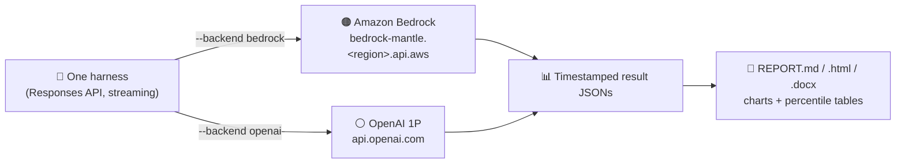
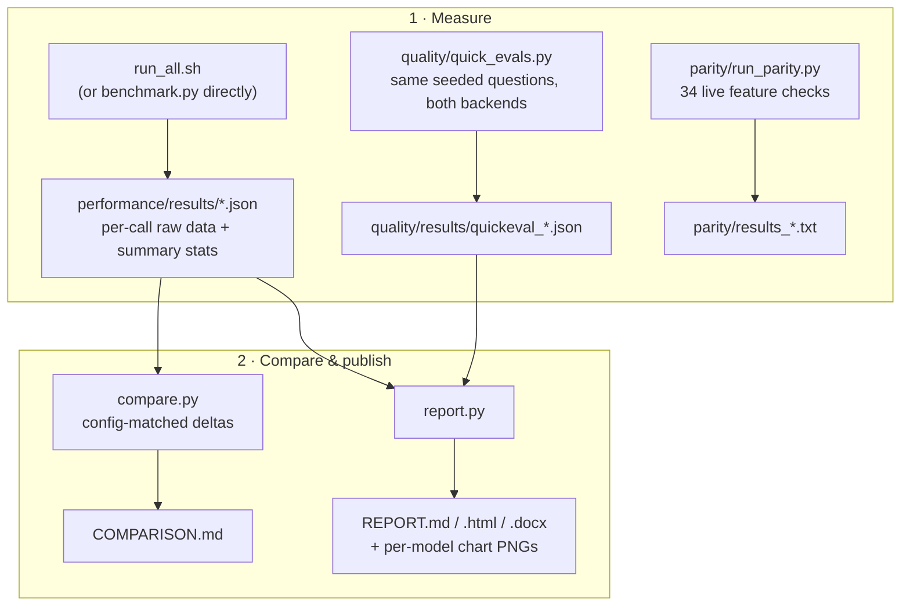

# ⚡ Benchmarks: OpenAI models on AWS

**How do OpenAI models on [Amazon Bedrock](https://aws.amazon.com/bedrock/) compare to the same models on OpenAI's own API?** This repo answers that with reproducible, bring-your-own-key benchmarks: latency, task quality, and API feature parity — measured through one identical code path on both backends, so the numbers are directly comparable.

> 🧭 **House rule:** every number we circulate traces back to a script and a timestamped results file in this repo. No hand-copied stats.



## 📦 What's inside

| Suite | Question it answers | Entry point |
|---|---|---|
| ⏱️ **performance/** | How fast? TTFT, inter-token latency, tokens/sec, E2E — p50/p95/p99 | `run_all.sh` · `benchmark.py` |
| 🎯 **quality/** | How accurate? MMLU-Pro, MATH-500, GSM8K, GPQA, AIME, HLE | `quick_evals.py` · per-eval scripts |
| 🧩 **parity/** | Which Responses-API features work on Bedrock? 34 live checks | `run_parity.py` |
| 📄 **report** | One shareable document from all results | `performance/report.py` |

## 🚀 Quick start

**You need:** Python 3.10+, AWS credentials (for the Bedrock side), and your own OpenAI API key (for the 1P side).

```bash
pip install -r requirements.txt

export OPENAI_API_KEY=sk-...     # your OpenAI 1P key
export AWS_REGION=us-west-2      # plus IAM credentials (profile/env/role)

./performance/run_all.sh         # full latency matrix, both backends → COMPARISON.md
```

That's it — defaults compare `openai.gpt-5.6-luna` (Bedrock) vs `gpt-5.6-luna` (1P) across 1k/5k/10k/20k-token inputs × 3 output budgets × 25 runs each. For a first look, shrink it:

```bash
RUNS=5 SIZES="1k 10k" ./performance/run_all.sh        # ~minutes instead of hours
BEDROCK_MODEL=openai.gpt-5.6-terra OPENAI_MODEL=gpt-5.6-terra ./performance/run_all.sh
SKIP_BEDROCK=1 ./performance/run_all.sh               # 1P side only
```

Then build the full report (percentile tables + charts + findings, as markdown/HTML/DOCX):

```bash
python performance/report.py     # → performance/results/REPORT.{md,html,docx}
```

### What the output looks like

Solid line = median call; shaded band = p5→p95 spread across 25 calls; dashed = p99 tail:


## 🔬 How it works



Both backends run through the **same Responses-API streaming code path** — same prompts, same token budgets, same retry logic — so any difference you see is the platform, not the harness. Every run records per-call raw measurements (including reasoning-token and cached-token counts, which matter a lot for reasoning models) alongside mean/stddev/p50/p95/p99/min/max summaries.

## ⏱️ Performance suite

<details>
<summary><b>Single-backend runs, flags, and comparing results</b></summary>

Run one backend directly:

```bash
# Bedrock (uses IAM creds, or AWS_BEARER_TOKEN_BEDROCK if set)
python performance/benchmark.py --backend bedrock --model openai.gpt-5.6-luna 1k --runs=5

# OpenAI 1P
python performance/benchmark.py --backend openai --model gpt-5.6-luna 1k --runs=5
```

| Flag | What it does |
|---|---|
| `--outputs 100,1000` | Override the per-size `max_output_tokens` sweep |
| `--effort none\|low\|medium\|high` | Set reasoning effort (gpt-5.6 accepts it on both backends) |
| `--concurrency N` | Fire N parallel requests to probe throughput under load |
| `--list-models` | Print the model ids your credentials can reach |
| `--tag smoke` | Label the results filename |

Compare any two runs that share a config:

```bash
python performance/compare.py --model-a openai.gpt-5.6-luna --model-b gpt-5.6-luna
```

This matches Bedrock and 1P runs on identical (input size, max output, concurrency, effort) configs and writes `performance/results/COMPARISON.md` with p50 TTFT / ITL / tok-s / E2E deltas. ⏳ Budget 30–60 min per input size per backend at 25 runs.

Legacy single-backend scripts (`benchmark_bedrock.py`, `benchmark_openai_saas.py`) are kept for provenance of the May–June 2026 results.

</details>

## 🎯 Quality suite

Two tiers, all switched between backends with `--backend mantle|saas`:

**Quick evals** — fixed-seed samples of community benchmarks (MMLU-Pro, MATH-500, GSM8K), exact-match scoring, every model sees the same questions:

```bash
python quality/quick_evals.py --backend mantle --model openai.gpt-5.6-luna --effort none
python quality/quick_evals.py --backend saas --model gpt-5.4-mini
python quality/quick_evals.py --rescore     # re-grade existing results after scorer changes
```

**Full evals** — GPQA Diamond (198 Qs × 5 repeats), AIME competition math, HLE text-only (~2,158 Qs):

```bash
python quality/gpqa_diamond.py --backend mantle
python quality/hle.py --backend mantle --max-questions 20    # quick smoke test
python quality/rescore_hle.py    # LLM-judge rescoring of strict exact-match HLE runs
```

> 📌 GPQA and HLE are gated on Hugging Face — accept their terms and `huggingface-cli login` first. MMLU-Pro, MATH-500, GSM8K, and AIME need no gating.

Methodology and completed-run details: [`quality/RESULTS.md`](quality/RESULTS.md). Per the house rule, accuracy numbers live in the results files, not here.

## 🧩 Parity suite

```bash
python parity/run_parity.py
```

34 live checks of the Responses API surface on Bedrock: streaming, multi-turn, stateful conversations (`previous_response_id`), structured output, function calling (single/parallel/forced/round-trip), image inputs, tool types, background mode, and usage reporting. Writes `parity/results_<model>_<region>.txt`; recorded runs for gpt-5.4 and gpt-5.6 luna/terra across three regions are checked in.

## 🎛️ Choosing models

```bash
python performance/benchmark.py --backend bedrock --list-models   # source of truth for your region
```

| Env var / flag | Used by | Default |
|---|---|---|
| `--model` | `performance/benchmark.py`, `quality/quick_evals.py` | `openai.gpt-5.6-luna` / `gpt-5.6-luna` |
| `BEDROCK_MODEL` / `OPENAI_MODEL` | `performance/run_all.sh` | `openai.gpt-5.6-luna` / `gpt-5.6-luna` |
| `MANTLE_MODEL` / `SAAS_MODEL` | full quality scripts, legacy benchmarks | `openai.gpt-5.4` / `gpt-5.4` |
| `AWS_REGION` | all Bedrock calls | `us-west-2` |
| `MANTLE_BASE_URL` | override the Bedrock endpoint | `https://bedrock-mantle.<AWS_REGION>.api.aws/openai/v1` |

OpenAI model ids on Bedrock (newest first): `openai.gpt-5.6-luna`, `-terra`, `-sol`, `openai.gpt-5.5`, `openai.gpt-5.4`, `openai.gpt-oss-120b`/`-20b`. ⚠️ **Availability varies by region** — e.g. as of July 2026, us-west-2 serves luna/terra but *not* sol (use us-east-1 for sol); `--list-models` is always the source of truth. The gpt-5.6 family rejects `temperature`/`top_p` but accepts `reasoning: {effort: ...}` including `none`.

## 🔐 Auth reference

<details>
<summary><b>Bedrock and OpenAI credential options</b></summary>

**Bedrock ("Mantle")** — two options:

1. Standard IAM credentials (env vars, profile, or instance role) — scripts mint short-lived tokens automatically via `aws-bedrock-token-generator`.
2. `AWS_BEARER_TOKEN_BEDROCK` — a pre-issued bearer token; quality scripts check this first, then fall back to IAM.

**OpenAI 1P** — bring your own key:

- `OPENAI_API_KEY` — used everywhere.
- Quality scripts prefer `OPENAI_API_KEY_SAAS` if set, so you can keep a separate key for eval runs.

Keys are read from the environment only — never stored in this repo.

</details>

## 🗺️ Migration workload pack

Migrating an existing OpenAI SaaS workload (gpt-5.4-mini/nano class) to Bedrock? [`docs/migration-workload-plan.md`](docs/migration-workload-plan.md) drafts a reusable pack: five workload archetypes, a model matrix (mini/nano baseline vs gpt-5.6 targets), precise metric definitions (task success, retries, p50/p95 latency, cost per successful task), and guidance on which model to test first — with customer-specific evals as the final gate.

## 📁 Repository layout

```
performance/
  benchmark.py          # ⭐ unified latency harness — one script, both backends
  compare.py            # config-matched Bedrock vs 1P deltas → COMPARISON.md
  report.py             # full report: percentile tables + charts + findings → md/html/docx
  run_all.sh            # one-command full matrix on both backends
  data/                 # canonical prompts: ~1k / 5k / 10k / 20k input tokens
  results/              # timestamped result JSONs, chart PNGs, REPORT.*
quality/
  quick_evals.py        # ⭐ MMLU-Pro / MATH-500 / GSM8K, seeded samples, both backends
  gpqa_diamond.py       # GPQA Diamond, 5 repeats, mean pass@1
  aime_2025.py          # AIME competition math (public 1983–2024 dataset)
  hle.py                # Humanity's Last Exam, text-only subset
  rescore_hle.py        # LLM-judge rescoring (Claude Haiku on Bedrock)
  RESULTS.md            # methodology + completed-run notes
parity/
  run_parity.py         # 34 Responses-API feature checks
docs/
  migration-workload-plan.md
```

## 🤝 Provenance, contributing, license

Ported from the internal `aws-research-science` benchmarks suite (runs dated May–June 2026), with account-specific values redacted. See [CONTRIBUTING.md](CONTRIBUTING.md) and [CODE_OF_CONDUCT.md](CODE_OF_CONDUCT.md); report security issues per [CONTRIBUTING.md](CONTRIBUTING.md#security-issue-notifications).

Dual-licensed: **code** under [MIT-0](LICENSE), **docs and text** under [CC-BY-SA 4.0](LICENSE-DOCS.md).
