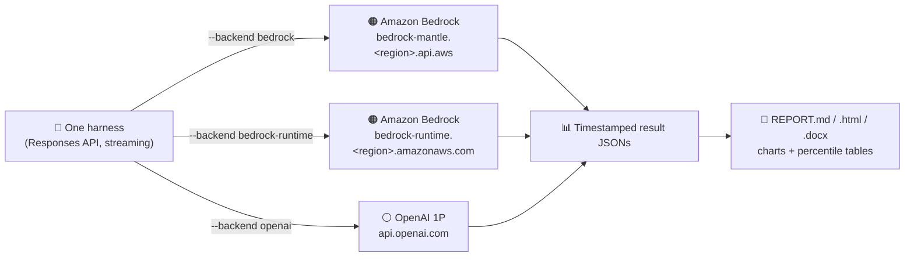
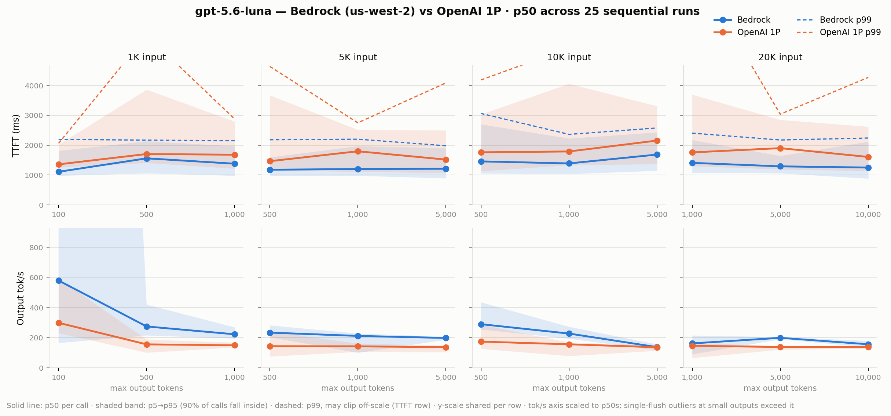
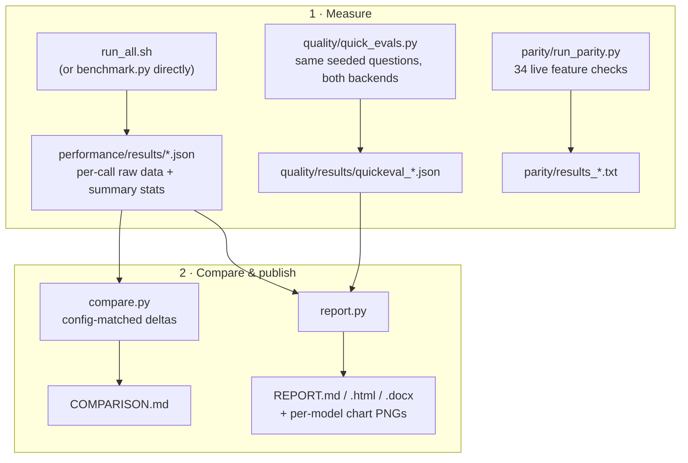

# ⚡ Benchmarks: OpenAI models on AWS

**How do OpenAI models compare on [Amazon Bedrock](https://aws.amazon.com/bedrock/)?** This repo provides reproducible benchmarks for latency, task quality, reasoning, and API feature support. The new ARC pilots discover Bedrock's OpenAI models and run the same tasks across them. Historical comparisons with OpenAI's own API are also available.

> 🧭 **House rule:** every number we circulate traces back to a script and a timestamped results file in this repo. No hand-copied stats.


```mermaid
flowchart LR
    H["🔬 One harness<br/>(Responses API, streaming)"]
    H -->|"--backend bedrock"| BR["🟠 Amazon Bedrock<br/>bedrock-mantle.&lt;region&gt;.api.aws"]
    H -->|"--backend bedrock-runtime"| BRT["🟠 Amazon Bedrock<br/>bedrock-runtime.&lt;region&gt;.amazonaws.com"]
    H -->|"--backend openai"| OP["⚪ OpenAI 1P<br/>api.openai.com"]
    BR --> R["📊 Timestamped result JSONs"]
    BRT --> R
    OP --> R
    R --> REP["📄 REPORT.md / .html / .docx<br/>charts + percentile tables"]
```

## 📦 What's inside

| Suite | Question it answers | Entry point |
|---|---|---|
| ⏱️ **performance/** | How fast? TTFT, inter-token latency, tokens/sec, E2E — p50/p95/p99 | `run_all.sh` · `benchmark.py` |
| 🎯 **quality/** | How accurate, per benchmark *and* per dollar? AIME, GPQA, MMLU-Pro, MATH-500, GSM8K, HumanEval — with cost-per-success | `quick_evals.py` |
| 🤖 **quality/ (agentic)** | How do multi-turn agents behave? Turn counts, trajectory cost, live web research | `agentic_evals.py` · `deepsearchqa/` |
| **[Bedrock Bench plugin](plugins/bedrock-bench/)** | Cost per successful agent task: starter tasks, CDK repair, Terminal-Bench, SWE-bench, and AWS-Bench | `bench.py` · [Suite guide](plugins/bedrock-bench/skills/benchmark-agent-tasks/references/suites.md) |
| 📝 **quality/ (deliverables)** | Can it produce professional work products? Rubric-judged GDPval slice | `gdpval_eval.py` |
| 🧩 **parity/** | Which Responses-API features work on Bedrock? 34 live checks | `run_parity.py` |
| **ARC pilots** | How do Bedrock's OpenAI models handle grid reasoning and interactive learning? | [Run guide](docs/arc-benchmarks.md) · `run_bedrock_arc.py` |
| 📊 **[GPT-4.1 vs GPT-5.6 comparison](comparisons/gpt-4.1-vs-gpt-5.6/)** | How do quality, recorded cost, and latency compare across 12 workloads and reasoning settings? Cross-platform saved-run evidence | [Results](comparisons/gpt-4.1-vs-gpt-5.6/RESULTS.md) · [Offline verification](comparisons/gpt-4.1-vs-gpt-5.6/README.md#reproduce-the-report) |
| 📄 **report** | One shareable document from all results | `performance/report.py` |

## 🚀 Quick start

For agent task economics, start with the credential-free demonstration:

```bash
python3 bench.py demo --out bench-results
```

This creates a clearly labeled synthetic report and exercises task scoring and
cost accounting. The [plugin guide](plugins/bedrock-bench/README.md) explains
live configurations, runner/provider selection, pricing, and installation.
With the installed plugin, ask in chat to run the AWS CDK smoke test or plan
an upstream benchmark. `python3.12 bench.py suites` lists the integrated suites;
`smoke --suite aws-cdk-smoke --execute` validates real CDK compilation,
synthesis, and grading in Docker without model calls or AWS deployment.

**Bedrock model comparisons:** Start with the [ARC-AGI-2 and ARC-AGI-3 guide](docs/arc-benchmarks.md).
`python run_bedrock_arc.py --discover --output-dir runs/bedrock-catalog` inventories
OpenAI models on Bedrock without making inference calls. Plan a comparison from
that catalogue, then use `--execute` for a bounded live run. These pilots need AWS
credentials only; ARC-AGI-3 uses the optional `requirements-arc.txt` dependencies.

**Adding GPT-6 Astra:** [coverage, model settings and run guide](docs/astra-benchmarks.md).
Preview the existing suites on Bedrock Mantle and Runtime with
`python run_astra.py --region us-west-2 --backends mantle,runtime`. Add `--execute` for live calls; the default
only prints the plan. Astra uses explicit `low` reasoning and requires fresh measurements.

**For the existing cross-platform comparison below:** Python 3.10+, AWS credentials,
and your own OpenAI API key. The ARC-AGI-3 toolkit requires Python 3.12+.

```bash
pip install -r requirements.txt

export OPENAI_API_KEY=sk-...     # your OpenAI 1P key
export AWS_REGION=us-west-2      # plus IAM credentials (profile/env/role)

./performance/run_all.sh         # full latency matrix, both backends → COMPARISON.md
```

That's it — defaults compare `openai.gpt-5.6-luna` (Bedrock) vs `gpt-5.6-luna` (1P) across 1k/5k/10k/20k-token inputs × 3 output budgets × 25 runs each. For a first look, shrink it:

```bash
RUNS=5 SIZES="1k 10k" ./performance/run_all.sh        # ~minutes instead of hours
BEDROCK_MODEL=openai.gpt-5.6-terra OPENAI_MODEL=gpt-5.6-terra ./performance/run_all.sh
SKIP_BEDROCK=1 ./performance/run_all.sh               # 1P side only
```

Then build the full report (percentile tables + charts + findings, as markdown/HTML/DOCX):

```bash
python performance/report.py     # → performance/results/REPORT.{md,html,docx}
```

### What the output looks like

Solid line = median call; shaded band = p5→p95 spread across 25 calls; dashed = p99 tail:



## 🔬 How it works


```mermaid
flowchart TD
    subgraph run ["1 · Measure"]
        RA["run_all.sh<br/>(or benchmark.py directly)"] --> J["performance/results/*.json<br/>per-call raw data + summary stats"]
        QE["quality/quick_evals.py<br/>same seeded questions, both backends"] --> QJ["quality/results/quickeval_*.json"]
        P["parity/run_parity.py<br/>34 live feature checks"] --> PT["parity/results_*.txt"]
    end
    subgraph analyze ["2 · Compare & publish"]
        J --> C["compare.py<br/>config-matched deltas"] --> CM["COMPARISON.md"]
        J --> REP["report.py"]
        QJ --> REP
        REP --> OUT["REPORT.md / .html / .docx<br/>+ per-model chart PNGs"]
    end
```

The streaming performance suite runs every backend through the **same Responses-API streaming code path**, with matching prompts, token budgets, and retry logic. It records raw measurements, including reasoning and cache usage, alongside percentile summaries. Bedrock Bench additionally supports complete agent-system comparisons through Codex, OpenCode, Harbor, and AWS-Bench; those comparisons include differences in the agent runners.

## ⏱️ Performance suite

<details>
<summary><b>Single-backend runs, flags, and comparing results</b></summary>

Run one backend directly:

```bash
# Bedrock (uses IAM creds, or AWS_BEARER_TOKEN_BEDROCK if set)
python performance/benchmark.py --backend bedrock --model openai.gpt-5.6-luna 1k --runs=5

# OpenAI 1P
python performance/benchmark.py --backend openai --model gpt-5.6-luna 1k --runs=5
```

| Flag | What it does |
|---|---|
| `--outputs 100,1000` | Override the per-size `max_output_tokens` sweep |
| `--effort none\|low\|medium\|high` | Set reasoning effort (gpt-5.6 accepts it on every backend) |
| `--concurrency N` | Fire N parallel requests to probe throughput under load |
| `--list-models` | Print the backend's model ids (for `bedrock-runtime`: all ACTIVE inference profiles in the region, regardless of access grants) |
| `--tag smoke` | Label the results filename |

Compare any two runs that share a config:

```bash
python performance/compare.py --model-a openai.gpt-5.6-luna --model-b gpt-5.6-luna
```

This matches Bedrock and 1P runs on identical (input size, max output, concurrency, effort) configs and writes `performance/results/COMPARISON.md` with p50 TTFT / ITL / tok-s / E2E deltas. ⏳ Budget 30–60 min per input size per backend at 25 runs.

Legacy single-backend scripts (`benchmark_bedrock.py`, `benchmark_openai_saas.py`) are kept for provenance of the May–June 2026 results.

</details>

## 🎯 Quality suite

The quick-eval, agentic, DeepSearchQA, and GDPval harnesses switch backends with `--backend mantle|saas|runtime` (the full-eval scripts also support these backends, with explicit `--model` and `--effort`) and emit timestamped result JSONs with per-attempt token usage, so cost-per-success falls out of every run. `mantle` is the `bedrock-mantle` OpenAI-compatible endpoint; `runtime` is the `bedrock-runtime` endpoint — same Responses API and auth, but model ids must be **inference profiles** (e.g. `--backend runtime --model us.openai.gpt-5.6-luna`; bare `openai.*` ids are rejected).

**Quick evals** — fixed-seed samples of six community benchmarks (AIME 2022–24, GPQA Diamond via ungated mirror, MMLU-Pro, MATH-500, GSM8K, HumanEval with official tests executed), exact-match scoring, every model sees the same questions:

```bash
python quality/quick_evals.py --backend mantle --model openai.gpt-5.6-luna --effort none
python quality/quick_evals.py --backend saas --model gpt-5.4-mini
python quality/quick_evals.py --rescore     # re-grade existing results after scorer changes
```

**Agentic multi-turn** — 6 tool-calling tasks × 5 repeats, deterministic mock backends, a real execute-and-feedback loop (max 12 turns). Measures success rate, turn counts, and trajectory cost:

```bash
python quality/agentic_evals.py --backend mantle --model openai.gpt-5.6-terra --effort none
```

**DeepSearchQA (live web research)** — stratified questions from google/deepsearchqa through a real `web_search` + `fetch_page` agent loop (Tavily-backed, disk-cached for reproducibility). Two-layer grading: deterministic pre-pass, then a frozen autorater prompt on gpt-5.5 (never a candidate model):

```bash
cp quality/deepsearchqa/eval.env.example quality/deepsearchqa/eval.env  # add Tavily key(s)
python quality/deepsearchqa/run_deepsearchqa.py --backend mantle --model openai.gpt-5.6-terra --effort none
python quality/deepsearchqa/judge_deepsearchqa.py       # grade unjudged result files
bash quality/deepsearchqa/run_all_arms.sh               # or: all five arms + judging
```

**GDPval (professional deliverables)** — a stratified text-only slice of openai/gdpval: real occupational work products graded item-by-item against human-authored rubrics by a gpt-5.5 judge (rubric-anchored; not comparable to the paper's human pairwise win rates):

```bash
python quality/gdpval_eval.py --backend mantle --model openai.gpt-5.6-luna --effort none
python quality/gdpval_eval.py --judge-only --judge-backend mantle   # judge; one backend per comparison
```

**Full evals** — GPQA Diamond (198 Qs × 5 repeats), AIME competition math, HLE text-only (~2,158 Qs):

```bash
python quality/gpqa_diamond.py --backend mantle
python quality/hle.py --backend mantle --max-questions 20    # quick smoke test
python quality/rescore_hle.py    # LLM-judge rescoring of strict exact-match HLE runs
```

> 📌 The canonical GPQA and HLE datasets are gated on Hugging Face — accept their terms and `huggingface-cli login` first. Everything else (AIME, MMLU-Pro, MATH-500, GSM8K, HumanEval, the GPQA mirror, deepsearchqa, gdpval) needs no gating.

Methodology and completed-run details: [`quality/RESULTS.md`](quality/RESULTS.md). Per the house rule, accuracy numbers live in the results files, not here.

## 🧩 Parity suite

```bash
python parity/run_parity.py
```

34 live checks of the Responses API surface on Bedrock: streaming, multi-turn, stateful conversations (`previous_response_id`), structured output, function calling (single/parallel/forced/round-trip), image inputs, tool types, background mode, and usage reporting. Writes `parity/results_<model>_<region>.txt`; recorded runs for gpt-5.4 and gpt-5.6 luna/terra across three regions are checked in.

## 🎛️ Choosing models

```bash
python performance/benchmark.py --backend bedrock --list-models   # source of truth for your region
```

| Env var / flag | Used by | Default |
|---|---|---|
| `--model` | `performance/benchmark.py` (required for quality scripts) | `openai.gpt-5.6-luna` (bedrock) / `us.openai.gpt-5.6-luna` (bedrock-runtime) / `gpt-5.6-luna` (openai) |
| `BEDROCK_MODEL` / `OPENAI_MODEL` | `performance/run_all.sh` | `openai.gpt-5.6-luna` / `gpt-5.6-luna` |
| `MANTLE_MODEL` / `SAAS_MODEL` | full quality scripts, legacy benchmarks | `openai.gpt-5.4` / `gpt-5.4` |
| `AWS_REGION` | all Bedrock calls | `us-west-2` |
| `MANTLE_BASE_URL` | override the Bedrock endpoint | `https://bedrock-mantle.<AWS_REGION>.api.aws/openai/v1` |
| `BEDROCK_RUNTIME_BASE_URL` | override the bedrock-runtime endpoint | `https://bedrock-runtime.<AWS_REGION>.amazonaws.com/openai/v1` |

OpenAI model ids on Bedrock (newest first): `openai.gpt-6-astra`, `openai.gpt-5.6-luna`, `-terra`, `-sol`, `openai.gpt-5.5`, `openai.gpt-5.4`, `openai.gpt-oss-120b`/`-20b`. ⚠️ **Availability varies by region** — e.g. as of July 2026, the bedrock-mantle endpoint in us-west-2 serves luna/terra but *not* sol (use us-east-1 for sol); `--list-models` is always the source of truth. The gpt-5.6 family rejects `temperature`/`top_p` but accepts `reasoning: {effort: ...}` including `none` — on both Bedrock endpoints.

Astra uses `low`/`medium`/`high`/`xhigh`/`max` reasoning; `none` is unsupported. Its Mantle endpoint is available in `us-west-2`. See the [Astra guide](docs/astra-benchmarks.md) for current IDs and caveats.

**bedrock-runtime backend** (`--backend bedrock-runtime` for performance, `--backend runtime` for quality): the same models addressed by **inference-profile id** — `us.openai.gpt-5.6-luna`/`-terra`/`-sol` (US cross-region) or `global.openai.gpt-5.6-*`. Bare `openai.*` ids return a 400 here. Cross-region profiles also mean all three gpt-5.6 models are reachable from us-west-2 on this backend, unlike mantle. `--backend bedrock-runtime --list-models` prints the ACTIVE profiles for your region (the runtime endpoint itself has no models API). gpt-5.5 has no inference profile, so the GDPval judge stays on `mantle`/`saas`.

## 🔐 Auth reference

<details>
<summary><b>Bedrock and OpenAI credential options</b></summary>

**Bedrock (both the "Mantle" and `bedrock-runtime` endpoints)** — two options:

1. Standard IAM credentials (env vars, profile, or instance role) — scripts mint short-lived tokens automatically via `aws-bedrock-token-generator`.
2. `AWS_BEARER_TOKEN_BEDROCK` — a pre-issued bearer token; quality scripts check this first, then fall back to IAM.

**OpenAI 1P** — bring your own key:

- `OPENAI_API_KEY` — used everywhere.
- Quality scripts prefer `OPENAI_API_KEY_SAAS` if set, so you can keep a separate key for eval runs.

Keys are read from the environment only — never stored in this repo.

</details>

## 🗺️ Migration workload pack

Migrating an existing OpenAI SaaS workload (gpt-5.4-mini/nano class) to Bedrock? [`docs/migration-workload-plan.md`](docs/migration-workload-plan.md) drafts a reusable pack: five workload archetypes, a model matrix (mini/nano baseline vs gpt-5.6 targets), precise metric definitions (task success, retries, p50/p95 latency, cost per successful task), and guidance on which model to test first — with customer-specific evals as the final gate.

## 📁 Repository layout

```
performance/
  benchmark.py          # ⭐ unified latency harness — one script, both backends
  compare.py            # config-matched Bedrock vs 1P deltas → COMPARISON.md
  report.py             # full report: percentile tables + charts + findings → md/html/docx
  run_all.sh            # one-command full matrix on both backends
  data/                 # canonical prompts: ~1k / 5k / 10k / 20k input tokens
  results/              # timestamped result JSONs, chart PNGs, REPORT.*
quality/
  quick_evals.py        # ⭐ 6 benchmarks + cost-per-success, seeded samples, both backends
  agentic_evals.py      # multi-turn tool-calling: success, turns, trajectory cost
  deepsearchqa/         # live-web research agent loop + two-layer judging
  gdpval_eval.py        # professional deliverables, rubric-judged (GDPval slice)
  gpqa_diamond.py       # GPQA Diamond, 5 repeats, mean pass@1
  aime_2025.py          # AIME competition math (public 1983–2024 dataset)
  hle.py                # Humanity's Last Exam, text-only subset
  rescore_hle.py        # LLM-judge rescoring (Claude Haiku on Bedrock)
  RESULTS.md            # methodology + completed-run notes
parity/
  run_parity.py         # 34 Responses-API feature checks
docs/
  migration-workload-plan.md
```

## 🤝 Provenance, contributing, license

Ported from the internal `aws-research-science` benchmarks suite (runs dated May–June 2026), with account-specific values redacted. See [CONTRIBUTING.md](CONTRIBUTING.md) and [CODE_OF_CONDUCT.md](CODE_OF_CONDUCT.md); report security issues per [CONTRIBUTING.md](CONTRIBUTING.md#security-issue-notifications).

Dual-licensed: **code** under [MIT-0](LICENSE), **docs and text** under [CC-BY-SA 4.0](LICENSE-DOCS.md).
