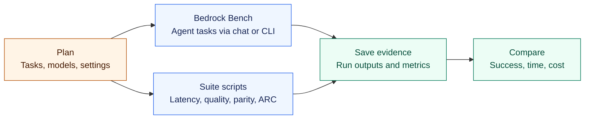

# OpenAI benchmarks on AWS

Compare OpenAI models on [Amazon Bedrock](https://aws.amazon.com/bedrock/) by
**task success, speed, and cost**. Run agent tasks, measure API performance, and
keep the evidence behind every result.

**Start with [Bedrock Bench](plugins/bedrock-bench/)**, the Codex plugin for
running AWS CDK repairs, Terminal-Bench, SWE-bench, and AWS-Bench from chat.

## Get started

[Install Bedrock Bench](plugins/bedrock-bench/README.md#install), select it in
Codex, and ask:

> Run the offline demo and explain success, timing, and cost per successful task.

Prefer the CLI? Try the same demo from a checkout with Python 3.12+:

```bash
git clone https://github.com/openai-on-aws/benchmarks-openai.git
cd benchmarks-openai
python3 bench.py demo --out bench-results
```

The demo uses synthetic results, needs no credentials or Docker, and saves a
readable report in `bench-results/`. Follow the
[plugin guide](plugins/bedrock-bench/README.md) to check a real CDK repair task
and prepare your first model comparison.

## Workflow


```mermaid
flowchart LR
    plan["Plan<br/>Tasks, models, settings"]
    agents["Bedrock Bench<br/>Agent tasks via chat or CLI"]
    scripts["Suite scripts<br/>Latency, quality, parity, ARC"]
    evidence["Save evidence<br/>Run outputs and metrics"]
    compare["Compare<br/>Success, time, cost"]

    plan --> agents
    plan --> scripts
    agents --> evidence
    scripts --> evidence
    evidence --> compare

    classDef setup fill:#fff4e6,stroke:#b45309,color:#451a03
    classDef runner fill:#eff6ff,stroke:#2563eb,color:#172554
    classDef result fill:#ecfdf5,stroke:#047857,color:#064e3b
    class plan setup
    class agents,scripts runner
    class evidence,compare result
```

Keep tasks and settings matched. Record the model, region, runner, and pricing
assumptions so comparisons are reproducible. Metrics and report formats vary by
suite; agent results reflect both the model and its runner.

## Choose a benchmark

| What do you want to measure? | Start here |
| --- | --- |
| Agent task success and cost per successful task | **[Bedrock Bench](plugins/bedrock-bench/)** — starter tasks, CDK repair, Terminal-Bench, SWE-bench, AWS-Bench |
| Response latency and throughput | [Performance](docs/benchmark-reference.md#performance) — time to first token, tokens/sec, p50/p95/p99 |
| Accuracy, tool use, research, and work products | [Quality](docs/benchmark-reference.md#quality) — quick evals, agentic tasks, DeepSearchQA, GDPval |
| Responses API feature support | [API parity](docs/benchmark-reference.md#api-parity) — streaming, tools, structured output, and more |
| Grid reasoning and interactive learning | [ARC pilots](docs/arc-benchmarks.md) — ARC-AGI-2 and ARC-AGI-3 on Bedrock |

## Guides and results

- [GPT-6 agentic experiments](examples/bedrock-bench/): prepared Astra, Sol, and Luna smoke and full-suite plans. Review a plan before making paid model calls.
- [Astra suite guide](docs/astra-benchmarks.md): settings and commands for the API benchmark suites.
- [Command reference](docs/benchmark-reference.md): setup, authentication, model selection, and detailed examples.
- [Recorded model comparisons](comparisons/gpt-4.1-vs-gpt-5.6/) and [quality results](quality/RESULTS.md): saved evidence and methodology.
- [Migration workload proposal](docs/migration-workload-plan.md): a planned pack for evaluating workloads moving to Bedrock.

Contributions welcome: see [Contributing](CONTRIBUTING.md) and the
[Code of Conduct](CODE_OF_CONDUCT.md).
Code is [MIT-0](LICENSE); documentation is [CC-BY-SA 4.0](LICENSE-DOCS.md).
