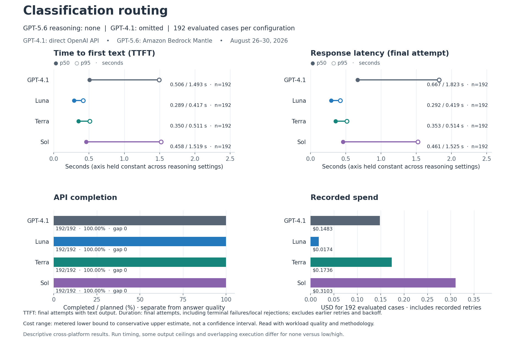
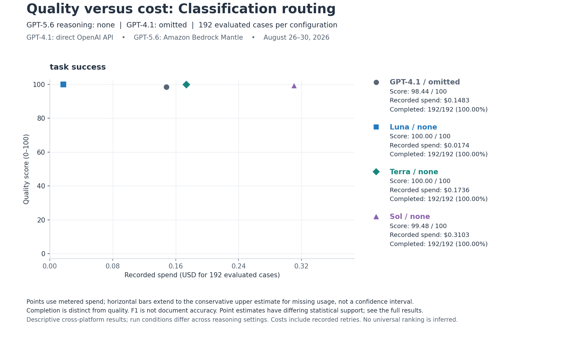
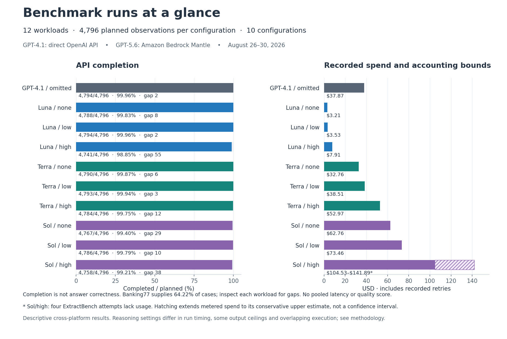

# Visual guide to the benchmark results

Compare responsiveness, completion, and recorded spend **within a workload**, alongside its answer-quality metric. These charts present the saved v1.1.0 measurements from August 26–30, 2026: GPT-4.1 through the direct OpenAI API and GPT-5.6 Luna, Terra, and Sol through Amazon Bedrock Mantle. These charts are included in reporting package 1.0.0-rc5.

## Explore a workload

Download [CHARTS.html](CHARTS.html) using GitHub's **Download raw file** action, then open the downloaded file in a browser. GitHub displays HTML source; it does not run this explorer inline. The single file contains all charts and displayed values. Switching views and downloading a selected chart require no network connection, Python installation, or inference calls.

Choose a workload and GPT-5.6 reasoning setting (`none`, `low`, or `high`). Each of the **36 views** contains four operational plots, a quality-versus-cost chart, and a quality table for GPT-4.1, Luna, Terra, and Sol. The same GPT-4.1 baseline is repeated in the low/high views; this covers all **120 distinct result cells**. Use **Download selected chart (SVG)** for the operational figure or **Download quality-cost chart (SVG)** for the scatter plot. Expand **Exact plotted values and timing populations** to inspect the numbers behind the charts.

Here is the classification-routing view with GPT-5.6 reasoning set to `none`:



## Read the four operational plots

| Plot | Meaning |
|---|---|
| Time to first text (TTFT) | Seconds from attempt start to the first nonempty streamed text delta. Only final attempts with that event contribute a sample; incomplete responses that emitted text are included. |
| Response latency (final attempt) | Seconds for the final retained attempt, including terminal failures and local input rejections. Earlier retry durations and backoff are excluded. This is not total application latency. |
| API completion | Completed responses divided by all planned cases, with both counts and a percentage. Completion is distinct from answer correctness. |
| Recorded spend | USD calculated from reported usage across all retained attempts, including retries. Hatching extends the metered lower bound to the conservative upper estimate when usage is missing. |

The filled and open timing markers show **p50 (median)** and **p95 (95th percentile)**. They are not confidence intervals. Sample counts are shown because TTFT and final-attempt duration use different populations. Timing and cost axes remain fixed for a workload across reasoning settings, but differ between workloads.

For Sol/high ExtractBench, four saved completed attempts lacked usage metadata. The cost range is **$78.10–$115.46**; its upper value is a conservative accounting estimate, not measured usage, a statistical confidence interval, or an exact billed total. Recorded prices describe these runs and are not current price quotations.

## Compare quality with recorded cost

The scatter plot places the selected workload's **quality score on the vertical axis** and **recorded USD on the horizontal axis**. Each of the four points represents one model at the selected setting; GPT-4.1 always uses the same reasoning-omitted baseline. The vertical axis spans the full 0–100 scale and labels the workload's actual metric, such as task accuracy or F1. Completed/planned counts and completion rates remain visible alongside the comparison.

The point's horizontal position is its metered cost lower bound for the evaluated cases, including recorded retries. A horizontal accounting bar extends to the conservative upper estimate when usage is missing. This bar describes cost accounting uncertainty; it is not a confidence interval for cost or quality. Costs are totals for the selected workload's evaluated N, not prices per request.

Synthetic invoice extraction uses **two separate panels**: strict document accuracy and address-normalized accuracy, labeled post hoc and exploratory. These panels score the same saved responses; their scoring rules are not combined into a single quality measure. Point positions alone do not establish a statistically supported advantage. Read them with completion, latency, and [the available statistical comparisons](RESULTS.md#statistical-uncertainty-and-comparison-coverage).

Here is the quality-versus-cost view for classification routing with GPT-5.6 reasoning set to `none`:



[Download quality-versus-cost example as SVG](charts/quality-cost-example.svg).

## Operating summary

The summary adds completed-case counts and recorded spend across the same 12 workloads for each configuration. It does not average workload latency percentiles or combine quality scores.



[Download summary as SVG](charts/operating-summary.svg).

**Inspect workload completion before drawing conclusions from the overall rate.** Banking77 supplies 64.22% of planned cases. For example, Luna/high's overall completion is 98.85%, while its ExtractBench completion is 88.11%; Sol/high's corresponding figures are 99.21% and 89.73%.

## Interpret operations alongside quality

The explorer's quality table preserves each workload's scoring rule. F1 is labeled separately from document accuracy. Synthetic invoice extraction shows strict accuracy and post hoc address-normalized accuracy together; normalization remains exploratory pending validation on fresh cases. Available statistical support differs by workload; consult [the full results and saved comparisons](RESULTS.md#statistical-uncertainty-and-comparison-coverage).

These are descriptive results for the tested datasets and configurations. Run timing, some output ceilings, and overlapping execution differ between `none` and `low`/`high`. Use the [methodology](METHODOLOGY.md) and representative customer workloads when assessing a deployment; these plots do not establish a universal model ranking.

## Reproduce the charts

The included HTML, PNG, and SVG files are ready to use. To verify their stored hashes and reproduce the report's Markdown/CSV, run from the repository root with Python 3.10+:

```sh
python3 -B comparisons/gpt-4.1-vs-gpt-5.6/render_report.py --verify
python3 -B comparisons/gpt-4.1-vs-gpt-5.6/test_render_charts.py
```

These commands use the standard library. The report verifier checks chart-file hashes; it does not rerender the figures. The chart tests check numeric mapping, coverage, and chart-data consistency against the preserved scorecard and recorded timing settings.

To regenerate the figures and offline explorer, install the optional plotting dependency in an isolated environment:

```sh
python3 -m venv .venv-charts
.venv-charts/bin/python -m pip install matplotlib==3.10.6
.venv-charts/bin/python -B comparisons/gpt-4.1-vs-gpt-5.6/render_charts.py --write
```

Installing Matplotlib requires package access; chart generation itself is offline. The renderer writes CHARTS.html and the files in [charts/](charts/), using [chart-template.html](chart-template.html), the preserved [scorecard](results/2026-08-30/scorecard.json), and [timing settings](evidence/run-settings.json). It does not alter measurement inputs or refresh the publication manifest. These operations reproduce presentation artifacts; they do not rerun inference or independently replicate grading.
