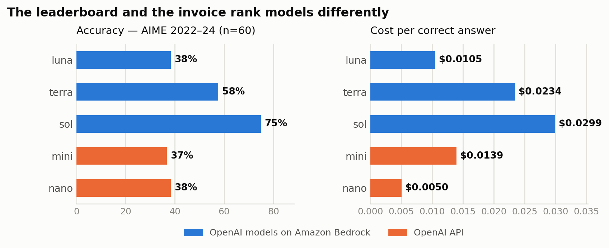
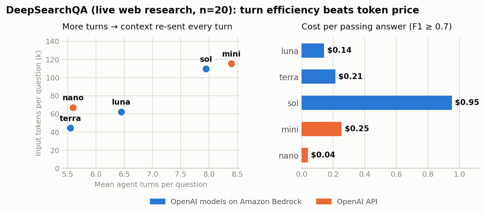
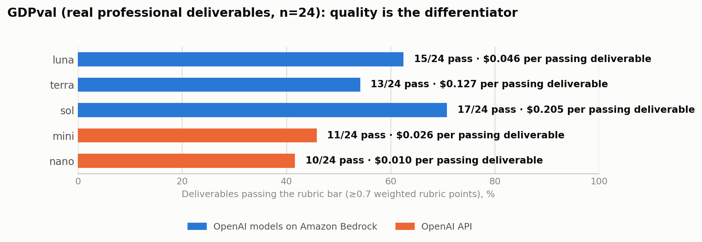

# Beyond the price per token: choosing the right OpenAI model on Amazon Bedrock for your workload

> **Draft for review — remove this block before submission.** Co-author candidates: AWS + OpenAI product. The same-platform latency paragraph needs explicit OpenAI co-author sign-off. An "About the authors" section is required at publication.

Organizations building generative AI applications usually compare models the same way: dollars per million tokens. It's the number on every pricing page, so it becomes the number in every spreadsheet. But production workloads don't buy tokens — they buy outcomes: a resolved support ticket, a completed research brief, a correct financial summary. Between the pricing page and the outcome sit multipliers the sticker price ignores: how often the model is right, how many tokens it needs to get there, and — for agentic workloads — how many turns it takes, because every turn re-sends the growing conversation.

In this post, we share results from an open-source benchmarking harness that measures those multipliers across OpenAI models on [Amazon Bedrock](https://aws.amazon.com/bedrock/) (gpt-5.6-luna, gpt-5.6-terra, and gpt-5.6-sol) and two widely used cost-efficient models on OpenAI's API (gpt-5.4-mini and gpt-5.4-nano). We chose the latter two as the cost-optimized baselines many teams start from — not as like-for-like generational peers — because "we run mini or nano today; is a newer model on Amazon Bedrock worth it?" is the question we hear most. We focus on three questions:

1. **What does a correct answer cost?** — not what does a token cost.
2. **What do agent trajectories cost?** — where turn count, not token price, dominates the bill.
3. **Can it produce work a professional would accept?** — measured on real occupational deliverables, not quiz questions.

Everything here is reproducible: the harness, [`openai-on-aws/benchmarks-openai`](https://github.com/openai-on-aws/benchmarks-openai), runs one identical code path (the OpenAI Responses API) against both platforms, and we encourage you to run it on your own tasks before making any decision.

## Solution overview

The harness evaluates all five models through the same Responses API client, switching only the backend and model ID, so every difference in the results comes from the model and platform rather than the test path. It measures three things: single-call accuracy and cost on benchmarks that still separate frontier models (AIME competition mathematics, GPQA Diamond graduate-level science, and MMLU-Pro — we deliberately skip saturated suites where every modern model scores in the mid-90s and differences are noise); multi-turn agent trajectories on live web-research tasks; and rubric-graded professional deliverables. Grading combines deterministic checks with an LLM judge (gpt-5.5, never one of the evaluated models) using frozen prompts whose hashes are recorded in every result file. Each run writes a timestamped result JSON, and every number and chart in this post is generated from those files at build time.

## Measuring the cost of a correct answer

For each benchmark we divide a model's *total* spend — across right and wrong attempts alike — by its number of correct answers. That's the price of the thing you actually want. The following graph shows accuracy and cost per correct answer on AIME for all five models; the pattern repeats on GPQA Diamond and MMLU-Pro (full tables in the repo).



Two things stand out:

- **Capability tiers are real.** Sol solves 75% of AIME problems to mini's 37%, and leads GPQA Diamond (68% vs 43%) and MMLU-Pro (82% vs 59%). No amount of retrying closes that gap cheaply — at 37% accuracy you're paying for nearly three attempts per success.
- **The sticker price can invert.** Luna's list price is roughly 1.5× mini's, yet its cost per correct AIME answer is **25% lower** ($0.0105 vs $0.0139) — luna, running with reasoning disabled, reaches the same answers with fewer billed tokens than mini spends at its defaults. The invoice, not the pricing page, reflects what you actually pay.

For customers this means the model selection question is never "which is cheapest per token" but "which is cheapest per *outcome*, at an accuracy my business accepts." Those are different models on different workloads — which is exactly why the harness exists.

## Measuring agent trajectory cost

Single-call pricing misses the defining feature of agentic workloads: every turn re-sends the entire conversation — system prompt, prior tool results, all of it. Input tokens grow superlinearly with turn count, and each turn adds a full round trip of latency. A model that finishes in 5 turns instead of 8 doesn't save 37% — it saves substantially more.

To measure this on a real workload, we ran a stratified sample of [DeepSearchQA](https://arxiv.org/abs/2601.20975) — multi-step web-research questions — through a live agent loop with real `web_search` and `fetch_page` tools. The following graph shows how turn count drives input-token volume (left) and what each passing answer ends up costing (right).



The left panel is the mechanism; the right panel is the consequence. Mini took the most turns per question, mostly re-search loops, and every extra turn re-sent a context stuffed with search results — 2.6× terra's input-token volume by the end. That's how terra, at roughly 3.7× mini's per-token price, ends up *cheaper per passing answer* ($0.21 vs $0.25) while scoring 26 F1 points higher. Luna beats mini on every axis: accuracy, turns, and cost. Nano remains the floor-price option per pass, but it passes only 35% of questions — fine when failures are discarded, disqualifying when each one triggers human review.

The customer takeaway: **turn efficiency is a pricing variable**, and it's invisible on the pricing page. If your agents chain tool calls — research, multi-hop lookups, iterative retrieval — benchmark trajectory cost, not call cost.

## Evaluating professional deliverables with GDPval

Benchmarks grade answers. Much of what customers ship is *documents* — compliance briefs, financial plans, care protocols — where "correct" is a rubric, not a string match. So we ran a 24-task slice of [GDPval](https://arxiv.org/abs/2510.04374): real occupational deliverables written by professionals with 14+ years of experience, each graded against its human-authored rubric. A deliverable passes at ≥70% of weighted rubric points. The following graph shows pass rates and cost per passing deliverable.



All three gpt-5.6 models out-write mini and nano — with reasoning disabled — and the gap concentrates in regulated professions (law, nursing, financial advice) where rubrics demand specific caveats, structure, and completeness. Luna beats mini head-to-head on 15 of 24 deliverables while losing only 4.

It's important to note that this workload is a single call, so there are no turn effects and **no cost inversion** — mini and nano stay cheaper per passing deliverable, and what gpt-5.6 buys is pass *rate*. Whether that trade wins depends on what a failed deliverable costs you. If a below-bar draft means a professional spends an hour reworking it, the rework — not the API bill — decides, and a model that passes 63% instead of 46% pays for itself quickly.

## Putting it together: a decision framework

| Your workload looks like… | Start with | Why |
|---|---|---|
| High-volume, simple tasks; failures are cheap | **gpt-5.4-nano or gpt-5.6-luna** — benchmark both | Nano is the floor price per success on easy work; luna adds reliability and speed for pennies |
| Interactive apps; accuracy matters; latency SLOs | **gpt-5.6-luna on Amazon Bedrock** | Matches or beats mini on every suite we ran, often cheaper per success, fastest per question in our harness |
| Agents that chain tool calls (research, multi-hop) | **gpt-5.6-terra on Amazon Bedrock** | Fewest turns and highest F1 on live web research; turn efficiency made it cheaper per pass than mini |
| Hard reasoning or quality-gated deliverables | **gpt-5.6-sol on Amazon Bedrock** | The accuracy ceiling in our runs (AIME 75%, GPQA 68%, MMLU-Pro 82%, GDPval 17/24); price the failure cost and its premium narrows |

We also measured same-model latency on both platforms with the same streaming harness. In our July 2026 runs (us-west-2, single-region, point-in-time — shared services vary with load, so treat these as a snapshot and re-measure): Bedrock's median time-to-first-token averaged 21% lower for luna and 5% lower for terra across the 12 matched configurations, luna's throughput averaged 43% higher on Bedrock at ≥500-token outputs (terra +4%), and — most relevant for anyone with a p99 SLO — luna and terra's worst-case TTFT tail ratios were 2.1–2.5× on Bedrock versus 4.6–6.6× on the OpenAI API. Sol behaves differently (it is a deep-reasoning model with inherently long and variable time-to-first-token, and its Bedrock runs used us-east-1); per-configuration detail for all three models is in the repo's [latency report](https://github.com/openai-on-aws/benchmarks-openai), and `performance/run_all.sh` reproduces the comparison on your own account. Beyond raw numbers, running OpenAI models on Amazon Bedrock keeps them inside your AWS security and governance boundary — [AWS Identity and Access Management (IAM)](https://aws.amazon.com/iam/) access control, [Amazon Virtual Private Cloud (Amazon VPC)](https://aws.amazon.com/vpc/) connectivity, [Amazon CloudWatch](https://aws.amazon.com/cloudwatch/) observability — alongside every other model your teams use.

## Run it on your workload

These results reflect our sample sizes and configuration choices: 20–198 questions per suite (DeepSearchQA 20, AIME 60, MMLU-Pro 140, GPQA Diamond 198), 24 deliverables, and reasoning disabled on the Bedrock models — a deliberate cost floor; enabling it raises both quality and spend. Your tasks are not our tasks. The methodology is the durable part:

```bash
git clone https://github.com/openai-on-aws/benchmarks-openai
pip install -r requirements.txt
export OPENAI_API_KEY=sk-...   # your own key; never stored
export AWS_REGION=us-west-2    # plus your standard AWS credentials

python quality/quick_evals.py       # accuracy + cost per correct answer
python quality/deepsearchqa/run_deepsearchqa.py   # live-web agent trajectories
python quality/gdpval_eval.py       # professional deliverables, rubric-judged
performance/run_all.sh              # latency, both platforms
```

Swap in 50–100 of your own tasks with known-good outputs and the same scripts produce cost-per-success numbers in your domain, on your account. That number — not any leaderboard, and not this post — is what belongs in your model-selection review.

## Conclusion

The per-token price is one input to a decision, not the decision. Across our runs, the model that wins the pricing page routinely loses the invoice once accuracy, token efficiency, and trajectory length are priced in — and the model that wins one workload loses another. Measure outcomes, price failures, and choose per workload.

To get started with OpenAI models on Amazon Bedrock, see the [Amazon Bedrock documentation](https://docs.aws.amazon.com/bedrock/). To reproduce these benchmarks on your own tasks, clone [`openai-on-aws/benchmarks-openai`](https://github.com/openai-on-aws/benchmarks-openai) and follow the steps in the previous section.

---

*Methodology notes: all runs July 2026; every number and chart traces to a timestamped result JSON in the repo (charts generated by `docs/img/build_blog_charts.py`). Bedrock models ran with `reasoning: {effort: none}`; models on OpenAI's API ran at their defaults. Grading: deterministic checks where possible plus an LLM judge (gpt-5.5, never one of the evaluated models) with frozen prompts hashed into result files. GDPval scores use a rubric-anchored LLM judge and are not comparable to the paper's human pairwise win rates; an 8,192-token output cap truncated more gpt-5.6 deliverables than gpt-5.4 ones (luna 3, terra 4, sol 6, mini 0, nano 1 of 24), so the gpt-5.6 GDPval scores are floors. DeepSearchQA n=20 and GDPval n=24 per model — treat small gaps as directional. Prices are July 2026 list per 1M input/output tokens: luna $1.10/$6.60, terra $2.75/$16.50, sol $5.50/$33.00, mini $0.75/$4.50, nano $0.20/$1.25.*
