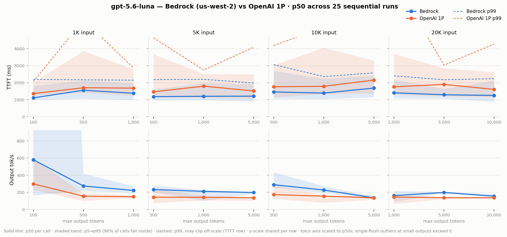
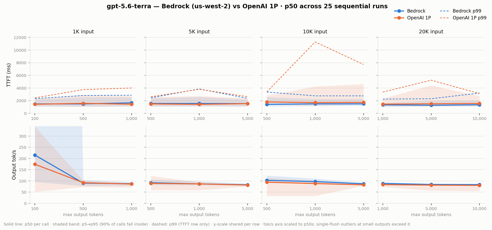
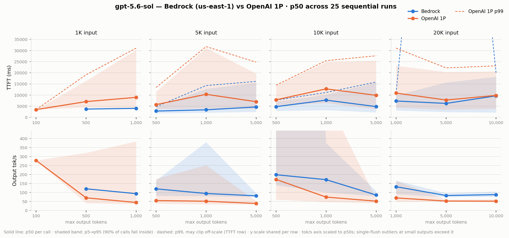

# GPT-5.6 on Amazon Bedrock vs OpenAI 1P — Latency & Quality Benchmark Report

**Generated:** 2026-07-23 13:31 UTC · **Repo:** [openai-on-aws/benchmarks-openai](https://github.com/openai-on-aws/benchmarks-openai)

Both backends are exercised through an identical code path — the OpenAI Responses API with streaming
(`performance/benchmark.py`). Metrics: **TTFT** (time to first output-text token), **Tok/s** (output tokens
per second of generation time), **E2E** (end-to-end wall time). Every number below is computed from the
timestamped result JSONs in `performance/results/` at report build time.

## 1. Test setup

| Parameter | Value |
|---|---|
| Models | `openai.gpt-5.6-luna`, `-terra`, `-sol` (Bedrock) vs `gpt-5.6-luna`, `-terra`, `-sol` (1P) |
| Bedrock endpoint | `https://bedrock-mantle.us-west-2.api.aws/openai/v1` (luna/terra) · `us-east-1` (sol — not served in us-west-2) |
| OpenAI 1P endpoint | `https://api.openai.com/v1` |
| API surface | Responses API, streaming — identical code path on both backends (`performance/benchmark.py`) |
| Auth | Bedrock: IAM via `aws-bedrock-token-generator` · 1P: user-supplied `OPENAI_API_KEY` |
| Runs per config | 25 |
| Concurrency | Single thread, sequential calls |
| Reasoning effort | Default (not set) |
| Output configs | 1k input: 100/500/1000 · 5k: 500/1000/5000 · 10k: 500/1000/5000 · 20k: 1000/5000/10000 |
| Prompt source | Manhattan Project (Wikipedia) — real varied text, no repetition |
| 1k input prompt | 1,002 verified tokens (4,219 chars) |
| 5k input prompt | 4,750 verified tokens (23,788 chars) |
| 10k input prompt | 9,984 verified tokens (47,568 chars) |
| 20k input prompt | 20,136 verified tokens (95,123 chars) |
| Run dates | 2026-07-18, 2026-07-20, 2026-07-21 (Bedrock luna 07-18; sol overnight 07-20→21; rest 07-20) |
| Total calls | 1,800 (3 errored) |

## 2. Key performance findings

- **TTFT is roughly flat across input sizes on Bedrock (gpt-5.6-luna):** at 1,000 max output tokens, p50 TTFT stays within 1,204–1,409 ms from 1K to 20K input tokens — a 20× larger prompt does not meaningfully move time-to-first-token.
- **TTFT is roughly flat across input sizes on Bedrock (gpt-5.6-terra):** at 1,000 max output tokens, p50 TTFT stays within 1,343–1,664 ms from 1K to 20K input tokens — a 20× larger prompt does not meaningfully move time-to-first-token.
- **gpt-5.6-luna TTFT:** averaged across all 12 configs, Bedrock p50 TTFT is 21% lower than 1P (1,345 vs 1,709 ms).
- **gpt-5.6-terra TTFT:** averaged across all 12 configs, Bedrock p50 TTFT is 5% lower than 1P (1,475 vs 1,556 ms).
- **gpt-5.6-sol TTFT:** averaged across all 12 configs, Bedrock p50 TTFT is 37% lower than 1P (5,364 vs 8,457 ms).
- **Throughput (≥500-token outputs):** luna averages 209.5 tok/s on Bedrock vs 146.3 on 1P (+43%); terra averages 89.2 vs 85.9 tok/s (+4%).
- **Luna streams ~2.0× faster than terra on both backends** (~178 vs ~88 tok/s at ≥500-token outputs) — a model characteristic, not a platform one.
- **gpt-5.6-luna TTFT tail:** worst p99/p50 ratio is 2.1× on Bedrock (10K/500 out) vs 4.6× on 1P (20K/1,000 out).
- **gpt-5.6-terra TTFT tail:** worst p99/p50 ratio is 2.5× on Bedrock (5K/1,000 out) vs 6.6× on 1P (10K/1,000 out).
- **gpt-5.6-sol TTFT tail:** worst p99/p50 ratio is 38.3× on Bedrock (20K/5,000 out) vs 3.5× on 1P (5K/5,000 out).
- **At 100-token output budgets, gpt-5.6 often spends the whole budget on reasoning and emits no visible text** (15/25 on Bedrock gpt-5.6-luna; 20/25 on OpenAI 1P gpt-5.6-luna; 5/25 on Bedrock gpt-5.6-terra; 25/25 on Bedrock gpt-5.6-sol; 24/25 on OpenAI 1P gpt-5.6-sol). Null-TTFT calls are excluded from latency stats; budget well above 100 output tokens for latency-sensitive use.
- **Responses often stop well before large `max_output_tokens` limits** (model finishes naturally rather than truncating): Bedrock gpt-5.6-luna 5K/5,000: mean 3,628 tokens; Bedrock gpt-5.6-luna 10K/5,000: mean 3,524 tokens; Bedrock gpt-5.6-luna 20K/5,000: mean 3,179 tokens; Bedrock gpt-5.6-luna 20K/10,000: mean 3,149 tokens; and 20 more configs.

### Caveats

- Bedrock **luna** ran 2026-07-18; all other matrices ran 2026-07-20 (sol overnight into 07-21), so the
  luna comparison includes day-to-day variance. The **terra** and **sol** comparisons are same-session
  on both backends.
- **Sol's Bedrock runs used us-east-1** (sol is not served in us-west-2), so its Bedrock-vs-1P deltas
  include a region difference; luna/terra used us-west-2.
- Sol is a deep-reasoning model: it spends heavily on reasoning tokens before the first visible token,
  so its TTFT is inherently higher and more variable than luna/terra on both backends.
- Sequential, default reasoning effort. Concurrency and effort sweeps are supported by the harness but
  not yet run.
- Delta convention: **positive = Bedrock better** (lower latency or higher throughput).

## 3. gpt-5.6-luna

### 3.1 Benchmark chart

**How to read this chart:** the solid line is the median (p50) call. The shaded band spans
p5→p95 — 90% of the 25 calls per config landed inside it, so a wide band means inconsistent
latency, not measurement error. The dashed line (TTFT row only) is p99, the worst-case tail.
One panel per input size; y-scale shared within each row.

### 3.2 Bedrock detail (all timings ms)

| Input | Max out | TTFT p50 | TTFT p95 | TTFT p99 | Tok/s p50 | E2E p50 | E2E p95 |
|---|---|---|---|---|---|---|---|
| 1K | 100 | 1,111 | 1,815 | 2,193 | 578.8 | 1,181 | 1,625 |
| 1K | 500 | 1,560 | 2,135 | 2,170 | 273.7 | 3,327 | 3,715 |
| 1K | 1,000 | 1,381 | 1,968 | 2,149 | 221.9 | 5,902 | 6,572 |
| 5K | 500 | 1,179 | 1,596 | 2,181 | 232.9 | 3,282 | 3,797 |
| 5K | 1,000 | 1,204 | 1,972 | 2,201 | 211.1 | 5,985 | 11,364 |
| 5K | 5,000 | 1,212 | 1,909 | 1,981 | 197.4 | 19,535 | 23,716 |
| 10K | 500 | 1,458 | 2,700 | 3,061 | 288.9 | 3,202 | 3,610 |
| 10K | 1,000 | 1,391 | 2,226 | 2,362 | 226.7 | 5,691 | 6,749 |
| 10K | 5,000 | 1,687 | 2,432 | 2,576 | 136.6 | 27,685 | 34,395 |
| 20K | 1,000 | 1,409 | 2,178 | 2,403 | 161.4 | 7,785 | 12,452 |
| 20K | 5,000 | 1,293 | 1,644 | 2,174 | 198.3 | 17,206 | 20,032 |
| 20K | 10,000 | 1,252 | 2,121 | 2,240 | 155.7 | 21,822 | 25,508 |

### 3.3 OpenAI 1P detail (all timings ms)

| Input | Max out | TTFT p50 | TTFT p95 | TTFT p99 | Tok/s p50 | E2E p50 | E2E p95 |
|---|---|---|---|---|---|---|---|
| 1K | 100 | 1,360 | 2,019 | 2,061 | 298.0 | 1,626 | 2,599 |
| 1K | 500 | 1,705 | 3,860 | 5,677 | 154.9 | 4,923 | 9,032 |
| 1K | 1,000 | 1,681 | 2,790 | 2,874 | 148.7 | 8,598 | 9,085 |
| 5K | 500 | 1,465 | 3,672 | 4,634 | 142.8 | 4,945 | 9,035 |
| 5K | 1,000 | 1,797 | 2,514 | 2,748 | 141.9 | 8,630 | 11,415 |
| 5K | 5,000 | 1,519 | 2,496 | 4,082 | 136.3 | 30,886 | 37,958 |
| 10K | 500 | 1,763 | 3,031 | 4,181 | 173.2 | 4,596 | 5,625 |
| 10K | 1,000 | 1,790 | 4,056 | 5,246 | 155.4 | 8,309 | 16,585 |
| 10K | 5,000 | 2,155 | 3,306 | 6,193 | 135.9 | 26,781 | 35,267 |
| 20K | 1,000 | 1,760 | 3,692 | 8,018 | 145.5 | 8,818 | 17,657 |
| 20K | 5,000 | 1,901 | 2,850 | 3,037 | 137.5 | 23,662 | 28,737 |
| 20K | 10,000 | 1,607 | 2,621 | 4,268 | 136.7 | 23,945 | 29,850 |

### 3.4 Side-by-side comparison

| Input | Max out | Metric | Bedrock | OpenAI 1P | Delta |
|---|---|---|---|---|---|
| 1K | 100 | TTFT p50 (ms) | 1,110.8 | 1,359.9 | +18% |
| 1K | 100 | TTFT p95 (ms) | 1,815.1 | 2,019.4 | +10% |
| 1K | 100 | TTFT p99 (ms) | 2,193.0 | 2,061.1 | -6% |
| 1K | 100 | Tok/s p50 | 578.8 | 298.0 | +94% |
| 1K | 100 | E2E p50 (ms) | 1,180.6 | 1,625.8 | +27% |
| 1K | 100 | E2E p95 (ms) | 1,625.4 | 2,598.8 | +37% |
| 1K | 500 | TTFT p50 (ms) | 1,560.4 | 1,705.2 | +8% |
| 1K | 500 | TTFT p95 (ms) | 2,134.6 | 3,859.8 | +45% |
| 1K | 500 | TTFT p99 (ms) | 2,169.7 | 5,677.4 | +62% |
| 1K | 500 | Tok/s p50 | 273.7 | 154.9 | +77% |
| 1K | 500 | E2E p50 (ms) | 3,327.1 | 4,922.8 | +32% |
| 1K | 500 | E2E p95 (ms) | 3,714.6 | 9,032.5 | +59% |
| 1K | 1,000 | TTFT p50 (ms) | 1,380.8 | 1,681.0 | +18% |
| 1K | 1,000 | TTFT p95 (ms) | 1,968.0 | 2,790.0 | +29% |
| 1K | 1,000 | TTFT p99 (ms) | 2,149.1 | 2,873.6 | +25% |
| 1K | 1,000 | Tok/s p50 | 221.9 | 148.7 | +49% |
| 1K | 1,000 | E2E p50 (ms) | 5,902.0 | 8,597.8 | +31% |
| 1K | 1,000 | E2E p95 (ms) | 6,571.5 | 9,085.1 | +28% |
| 5K | 500 | TTFT p50 (ms) | 1,179.3 | 1,465.1 | +20% |
| 5K | 500 | TTFT p95 (ms) | 1,596.2 | 3,672.4 | +57% |
| 5K | 500 | TTFT p99 (ms) | 2,180.8 | 4,634.2 | +53% |
| 5K | 500 | Tok/s p50 | 232.9 | 142.8 | +63% |
| 5K | 500 | E2E p50 (ms) | 3,281.5 | 4,945.2 | +34% |
| 5K | 500 | E2E p95 (ms) | 3,797.0 | 9,035.2 | +58% |
| 5K | 1,000 | TTFT p50 (ms) | 1,203.9 | 1,796.6 | +33% |
| 5K | 1,000 | TTFT p95 (ms) | 1,972.0 | 2,514.5 | +22% |
| 5K | 1,000 | TTFT p99 (ms) | 2,200.6 | 2,748.2 | +20% |
| 5K | 1,000 | Tok/s p50 | 211.1 | 141.9 | +49% |
| 5K | 1,000 | E2E p50 (ms) | 5,984.6 | 8,629.9 | +31% |
| 5K | 1,000 | E2E p95 (ms) | 11,364.0 | 11,415.3 | +0% |
| 5K | 5,000 | TTFT p50 (ms) | 1,211.9 | 1,519.1 | +20% |
| 5K | 5,000 | TTFT p95 (ms) | 1,909.4 | 2,496.4 | +24% |
| 5K | 5,000 | TTFT p99 (ms) | 1,981.3 | 4,082.5 | +51% |
| 5K | 5,000 | Tok/s p50 | 197.4 | 136.3 | +45% |
| 5K | 5,000 | E2E p50 (ms) | 19,535.4 | 30,886.4 | +37% |
| 5K | 5,000 | E2E p95 (ms) | 23,716.5 | 37,957.9 | +38% |
| 10K | 500 | TTFT p50 (ms) | 1,458.4 | 1,762.6 | +17% |
| 10K | 500 | TTFT p95 (ms) | 2,700.5 | 3,031.3 | +11% |
| 10K | 500 | TTFT p99 (ms) | 3,060.8 | 4,181.2 | +27% |
| 10K | 500 | Tok/s p50 | 288.9 | 173.2 | +67% |
| 10K | 500 | E2E p50 (ms) | 3,202.3 | 4,596.0 | +30% |
| 10K | 500 | E2E p95 (ms) | 3,609.6 | 5,625.1 | +36% |
| 10K | 1,000 | TTFT p50 (ms) | 1,390.6 | 1,790.4 | +22% |
| 10K | 1,000 | TTFT p95 (ms) | 2,225.9 | 4,055.6 | +45% |
| 10K | 1,000 | TTFT p99 (ms) | 2,361.6 | 5,246.4 | +55% |
| 10K | 1,000 | Tok/s p50 | 226.7 | 155.4 | +46% |
| 10K | 1,000 | E2E p50 (ms) | 5,691.2 | 8,309.0 | +32% |
| 10K | 1,000 | E2E p95 (ms) | 6,748.9 | 16,585.4 | +59% |
| 10K | 5,000 | TTFT p50 (ms) | 1,686.6 | 2,155.2 | +22% |
| 10K | 5,000 | TTFT p95 (ms) | 2,431.5 | 3,306.0 | +26% |
| 10K | 5,000 | TTFT p99 (ms) | 2,576.1 | 6,193.1 | +58% |
| 10K | 5,000 | Tok/s p50 | 136.6 | 135.9 | +1% |
| 10K | 5,000 | E2E p50 (ms) | 27,685.4 | 26,781.0 | -3% |
| 10K | 5,000 | E2E p95 (ms) | 34,394.8 | 35,267.2 | +2% |
| 20K | 1,000 | TTFT p50 (ms) | 1,409.4 | 1,759.5 | +20% |
| 20K | 1,000 | TTFT p95 (ms) | 2,177.7 | 3,692.5 | +41% |
| 20K | 1,000 | TTFT p99 (ms) | 2,403.4 | 8,017.5 | +70% |
| 20K | 1,000 | Tok/s p50 | 161.4 | 145.5 | +11% |
| 20K | 1,000 | E2E p50 (ms) | 7,785.3 | 8,817.9 | +12% |
| 20K | 1,000 | E2E p95 (ms) | 12,452.4 | 17,657.1 | +29% |
| 20K | 5,000 | TTFT p50 (ms) | 1,292.7 | 1,901.3 | +32% |
| 20K | 5,000 | TTFT p95 (ms) | 1,643.5 | 2,849.8 | +42% |
| 20K | 5,000 | TTFT p99 (ms) | 2,173.7 | 3,036.6 | +28% |
| 20K | 5,000 | Tok/s p50 | 198.3 | 137.5 | +44% |
| 20K | 5,000 | E2E p50 (ms) | 17,205.9 | 23,662.0 | +27% |
| 20K | 5,000 | E2E p95 (ms) | 20,032.2 | 28,737.1 | +30% |
| 20K | 10,000 | TTFT p50 (ms) | 1,252.2 | 1,607.3 | +22% |
| 20K | 10,000 | TTFT p95 (ms) | 2,120.8 | 2,620.8 | +19% |
| 20K | 10,000 | TTFT p99 (ms) | 2,239.6 | 4,267.6 | +48% |
| 20K | 10,000 | Tok/s p50 | 155.7 | 136.7 | +14% |
| 20K | 10,000 | E2E p50 (ms) | 21,821.7 | 23,945.0 | +9% |
| 20K | 10,000 | E2E p95 (ms) | 25,508.2 | 29,849.6 | +15% |

## 4. gpt-5.6-terra

### 4.1 Benchmark chart

**How to read this chart:** the solid line is the median (p50) call. The shaded band spans
p5→p95 — 90% of the 25 calls per config landed inside it, so a wide band means inconsistent
latency, not measurement error. The dashed line (TTFT row only) is p99, the worst-case tail.
One panel per input size; y-scale shared within each row.

### 4.2 Bedrock detail (all timings ms)

| Input | Max out | TTFT p50 | TTFT p95 | TTFT p99 | Tok/s p50 | E2E p50 | E2E p95 |
|---|---|---|---|---|---|---|---|
| 1K | 100 | 1,490 | 2,186 | 2,322 | 215.2 | 1,938 | 2,351 |
| 1K | 500 | 1,492 | 2,564 | 2,818 | 90.1 | 7,124 | 8,013 |
| 1K | 1,000 | 1,664 | 2,545 | 2,870 | 87.4 | 13,512 | 14,150 |
| 5K | 500 | 1,562 | 2,379 | 2,454 | 91.8 | 6,951 | 7,638 |
| 5K | 1,000 | 1,559 | 2,622 | 3,858 | 86.5 | 13,036 | 14,258 |
| 5K | 5,000 | 1,538 | 2,181 | 2,369 | 82.7 | 42,681 | 51,922 |
| 10K | 500 | 1,418 | 2,578 | 3,367 | 102.7 | 6,318 | 6,874 |
| 10K | 1,000 | 1,498 | 2,254 | 2,763 | 96.9 | 11,746 | 12,723 |
| 10K | 5,000 | 1,494 | 2,259 | 2,764 | 87.1 | 43,905 | 53,316 |
| 20K | 1,000 | 1,343 | 1,667 | 2,252 | 88.4 | 12,681 | 13,624 |
| 20K | 5,000 | 1,283 | 2,018 | 2,311 | 84.2 | 42,622 | 46,187 |
| 20K | 10,000 | 1,359 | 2,039 | 3,207 | 83.3 | 39,446 | 48,804 |

### 4.3 OpenAI 1P detail (all timings ms)

| Input | Max out | TTFT p50 | TTFT p95 | TTFT p99 | Tok/s p50 | E2E p50 | E2E p95 |
|---|---|---|---|---|---|---|---|
| 1K | 100 | 1,434 | 2,296 | 2,442 | 174.3 | 2,016 | 3,671 |
| 1K | 500 | 1,581 | 2,924 | 3,754 | 92.0 | 7,030 | 9,058 |
| 1K | 1,000 | 1,447 | 2,741 | 4,005 | 86.1 | 13,289 | 15,406 |
| 5K | 500 | 1,491 | 2,587 | 2,614 | 89.1 | 7,086 | 9,936 |
| 5K | 1,000 | 1,422 | 2,723 | 3,805 | 86.7 | 12,979 | 19,224 |
| 5K | 5,000 | 1,535 | 2,414 | 2,636 | 81.3 | 48,742 | 53,087 |
| 10K | 500 | 1,806 | 2,813 | 3,390 | 94.3 | 7,138 | 17,214 |
| 10K | 1,000 | 1,699 | 4,244 | 11,283 | 88.2 | 13,025 | 35,501 |
| 10K | 5,000 | 1,727 | 4,634 | 7,728 | 82.4 | 44,416 | 58,804 |
| 20K | 1,000 | 1,455 | 2,357 | 3,363 | 83.4 | 13,448 | 15,727 |
| 20K | 5,000 | 1,510 | 4,412 | 5,239 | 81.1 | 40,318 | 72,056 |
| 20K | 10,000 | 1,563 | 2,759 | 3,123 | 79.9 | 40,771 | 67,593 |

### 4.4 Side-by-side comparison

| Input | Max out | Metric | Bedrock | OpenAI 1P | Delta |
|---|---|---|---|---|---|
| 1K | 100 | TTFT p50 (ms) | 1,489.9 | 1,434.5 | -4% |
| 1K | 100 | TTFT p95 (ms) | 2,186.0 | 2,296.5 | +5% |
| 1K | 100 | TTFT p99 (ms) | 2,322.0 | 2,441.7 | +5% |
| 1K | 100 | Tok/s p50 | 215.2 | 174.3 | +23% |
| 1K | 100 | E2E p50 (ms) | 1,938.1 | 2,015.8 | +4% |
| 1K | 100 | E2E p95 (ms) | 2,350.8 | 3,671.4 | +36% |
| 1K | 500 | TTFT p50 (ms) | 1,492.1 | 1,580.7 | +6% |
| 1K | 500 | TTFT p95 (ms) | 2,563.7 | 2,924.3 | +12% |
| 1K | 500 | TTFT p99 (ms) | 2,817.7 | 3,753.5 | +25% |
| 1K | 500 | Tok/s p50 | 90.1 | 92.0 | -2% |
| 1K | 500 | E2E p50 (ms) | 7,123.6 | 7,029.5 | -1% |
| 1K | 500 | E2E p95 (ms) | 8,013.3 | 9,057.9 | +12% |
| 1K | 1,000 | TTFT p50 (ms) | 1,663.5 | 1,447.4 | -15% |
| 1K | 1,000 | TTFT p95 (ms) | 2,545.4 | 2,740.8 | +7% |
| 1K | 1,000 | TTFT p99 (ms) | 2,870.4 | 4,004.9 | +28% |
| 1K | 1,000 | Tok/s p50 | 87.4 | 86.1 | +2% |
| 1K | 1,000 | E2E p50 (ms) | 13,512.4 | 13,289.1 | -2% |
| 1K | 1,000 | E2E p95 (ms) | 14,150.0 | 15,405.9 | +8% |
| 5K | 500 | TTFT p50 (ms) | 1,561.8 | 1,490.8 | -5% |
| 5K | 500 | TTFT p95 (ms) | 2,378.8 | 2,587.1 | +8% |
| 5K | 500 | TTFT p99 (ms) | 2,454.0 | 2,614.5 | +6% |
| 5K | 500 | Tok/s p50 | 91.8 | 89.1 | +3% |
| 5K | 500 | E2E p50 (ms) | 6,950.7 | 7,086.2 | +2% |
| 5K | 500 | E2E p95 (ms) | 7,638.2 | 9,935.6 | +23% |
| 5K | 1,000 | TTFT p50 (ms) | 1,559.3 | 1,421.5 | -10% |
| 5K | 1,000 | TTFT p95 (ms) | 2,621.9 | 2,722.7 | +4% |
| 5K | 1,000 | TTFT p99 (ms) | 3,857.8 | 3,804.8 | -1% |
| 5K | 1,000 | Tok/s p50 | 86.5 | 86.7 | -0% |
| 5K | 1,000 | E2E p50 (ms) | 13,035.9 | 12,979.4 | -0% |
| 5K | 1,000 | E2E p95 (ms) | 14,257.7 | 19,224.2 | +26% |
| 5K | 5,000 | TTFT p50 (ms) | 1,537.9 | 1,535.1 | -0% |
| 5K | 5,000 | TTFT p95 (ms) | 2,181.4 | 2,414.3 | +10% |
| 5K | 5,000 | TTFT p99 (ms) | 2,369.2 | 2,636.3 | +10% |
| 5K | 5,000 | Tok/s p50 | 82.7 | 81.3 | +2% |
| 5K | 5,000 | E2E p50 (ms) | 42,680.7 | 48,741.7 | +12% |
| 5K | 5,000 | E2E p95 (ms) | 51,922.4 | 53,086.8 | +2% |
| 10K | 500 | TTFT p50 (ms) | 1,417.5 | 1,805.7 | +21% |
| 10K | 500 | TTFT p95 (ms) | 2,578.0 | 2,812.7 | +8% |
| 10K | 500 | TTFT p99 (ms) | 3,366.6 | 3,390.0 | +1% |
| 10K | 500 | Tok/s p50 | 102.7 | 94.3 | +9% |
| 10K | 500 | E2E p50 (ms) | 6,318.2 | 7,138.1 | +11% |
| 10K | 500 | E2E p95 (ms) | 6,874.3 | 17,213.6 | +60% |
| 10K | 1,000 | TTFT p50 (ms) | 1,498.5 | 1,699.2 | +12% |
| 10K | 1,000 | TTFT p95 (ms) | 2,254.1 | 4,243.5 | +47% |
| 10K | 1,000 | TTFT p99 (ms) | 2,763.1 | 11,282.8 | +76% |
| 10K | 1,000 | Tok/s p50 | 96.9 | 88.2 | +10% |
| 10K | 1,000 | E2E p50 (ms) | 11,745.6 | 13,024.6 | +10% |
| 10K | 1,000 | E2E p95 (ms) | 12,722.7 | 35,500.6 | +64% |
| 10K | 5,000 | TTFT p50 (ms) | 1,494.1 | 1,726.9 | +13% |
| 10K | 5,000 | TTFT p95 (ms) | 2,259.4 | 4,633.7 | +51% |
| 10K | 5,000 | TTFT p99 (ms) | 2,763.6 | 7,727.9 | +64% |
| 10K | 5,000 | Tok/s p50 | 87.1 | 82.4 | +6% |
| 10K | 5,000 | E2E p50 (ms) | 43,905.3 | 44,415.9 | +1% |
| 10K | 5,000 | E2E p95 (ms) | 53,315.6 | 58,803.8 | +9% |
| 20K | 1,000 | TTFT p50 (ms) | 1,342.9 | 1,454.8 | +8% |
| 20K | 1,000 | TTFT p95 (ms) | 1,666.7 | 2,356.8 | +29% |
| 20K | 1,000 | TTFT p99 (ms) | 2,252.3 | 3,363.2 | +33% |
| 20K | 1,000 | Tok/s p50 | 88.4 | 83.4 | +6% |
| 20K | 1,000 | E2E p50 (ms) | 12,681.1 | 13,448.3 | +6% |
| 20K | 1,000 | E2E p95 (ms) | 13,623.5 | 15,727.1 | +13% |
| 20K | 5,000 | TTFT p50 (ms) | 1,283.4 | 1,510.0 | +15% |
| 20K | 5,000 | TTFT p95 (ms) | 2,018.3 | 4,411.5 | +54% |
| 20K | 5,000 | TTFT p99 (ms) | 2,311.1 | 5,238.6 | +56% |
| 20K | 5,000 | Tok/s p50 | 84.2 | 81.1 | +4% |
| 20K | 5,000 | E2E p50 (ms) | 42,621.5 | 40,317.8 | -6% |
| 20K | 5,000 | E2E p95 (ms) | 46,187.1 | 72,055.5 | +36% |
| 20K | 10,000 | TTFT p50 (ms) | 1,359.4 | 1,563.4 | +13% |
| 20K | 10,000 | TTFT p95 (ms) | 2,039.1 | 2,759.1 | +26% |
| 20K | 10,000 | TTFT p99 (ms) | 3,206.7 | 3,123.4 | -3% |
| 20K | 10,000 | Tok/s p50 | 83.3 | 79.9 | +4% |
| 20K | 10,000 | E2E p50 (ms) | 39,446.1 | 40,770.7 | +3% |
| 20K | 10,000 | E2E p95 (ms) | 48,804.3 | 67,593.1 | +28% |

## 5. gpt-5.6-sol

### 5.1 Benchmark chart

**How to read this chart:** the solid line is the median (p50) call. The shaded band spans
p5→p95 — 90% of the 25 calls per config landed inside it, so a wide band means inconsistent
latency, not measurement error. The dashed line (TTFT row only) is p99, the worst-case tail.
One panel per input size; y-scale shared within each row.

### 5.2 Bedrock detail (all timings ms)

| Input | Max out | TTFT p50 | TTFT p95 | TTFT p99 | Tok/s p50 | E2E p50 | E2E p95 |
|---|---|---|---|---|---|---|---|
| 1K | 100 | n/a | n/a | n/a | n/a | 1,824 | 2,900 |
| 1K | 500 | 3,698 | 7,393 | 7,513 | 120.0 | 7,644 | 8,668 |
| 1K | 1,000 | 4,010 | 11,620 | 12,430 | 93.0 | 14,711 | 16,426 |
| 5K | 500 | 2,801 | 4,619 | 4,719 | 119.7 | 7,285 | 8,424 |
| 5K | 1,000 | 3,366 | 12,811 | 14,252 | 94.0 | 14,446 | 15,832 |
| 5K | 5,000 | 4,642 | 15,504 | 16,138 | 81.1 | 59,491 | 69,453 |
| 10K | 500 | 4,770 | 7,005 | 7,706 | 198.4 | 6,859 | 8,121 |
| 10K | 1,000 | 7,714 | 10,195 | 11,142 | 170.9 | 13,446 | 15,374 |
| 10K | 5,000 | 4,804 | 15,616 | 15,837 | 85.4 | 48,838 | 63,951 |
| 20K | 1,000 | 7,318 | 9,874 | 10,862 | 131.7 | 14,642 | 16,805 |
| 20K | 5,000 | 6,239 | 15,632 | 238,776 | 82.7 | 47,918 | 81,118 |
| 20K | 10,000 | 9,638 | 18,197 | 19,932 | 87.5 | 51,080 | 64,265 |

### 5.3 OpenAI 1P detail (all timings ms)

| Input | Max out | TTFT p50 | TTFT p95 | TTFT p99 | Tok/s p50 | E2E p50 | E2E p95 |
|---|---|---|---|---|---|---|---|
| 1K | 100 | 3,452 | 3,452 | 3,452 | 277.6 | 4,038 | 7,304 |
| 1K | 500 | 7,050 | 16,325 | 19,133 | 69.8 | 15,974 | 21,124 |
| 1K | 1,000 | 8,957 | 30,291 | 31,085 | 43.8 | 31,654 | 34,684 |
| 5K | 500 | 5,710 | 11,499 | 13,422 | 54.6 | 15,764 | 19,141 |
| 5K | 1,000 | 10,323 | 31,187 | 31,771 | 50.9 | 31,702 | 37,027 |
| 5K | 5,000 | 7,018 | 19,657 | 24,798 | 38.5 | 127,664 | 152,521 |
| 10K | 500 | 7,847 | 14,251 | 14,428 | 172.2 | 11,548 | 16,419 |
| 10K | 1,000 | 12,772 | 24,874 | 25,446 | 73.9 | 26,892 | 33,173 |
| 10K | 5,000 | 9,869 | 25,367 | 27,641 | 51.4 | 78,596 | 121,496 |
| 20K | 1,000 | 10,886 | 23,204 | 31,088 | 69.2 | 23,194 | 30,468 |
| 20K | 5,000 | 7,770 | 20,352 | 22,188 | 51.8 | 81,982 | 95,518 |
| 20K | 10,000 | 9,829 | 20,618 | 23,119 | 51.3 | 74,112 | 89,194 |

### 5.4 Side-by-side comparison

| Input | Max out | Metric | Bedrock | OpenAI 1P | Delta |
|---|---|---|---|---|---|
| 1K | 100 | TTFT p50 (ms) | n/a | 3,452.0 | n/a |
| 1K | 100 | TTFT p95 (ms) | n/a | 3,452.0 | n/a |
| 1K | 100 | TTFT p99 (ms) | n/a | 3,452.0 | n/a |
| 1K | 100 | Tok/s p50 | n/a | 277.6 | n/a |
| 1K | 100 | E2E p50 (ms) | 1,823.9 | 4,037.6 | +55% |
| 1K | 100 | E2E p95 (ms) | 2,900.1 | 7,303.6 | +60% |
| 1K | 500 | TTFT p50 (ms) | 3,698.0 | 7,049.7 | +48% |
| 1K | 500 | TTFT p95 (ms) | 7,393.0 | 16,325.2 | +55% |
| 1K | 500 | TTFT p99 (ms) | 7,512.8 | 19,132.7 | +61% |
| 1K | 500 | Tok/s p50 | 120.0 | 69.8 | +72% |
| 1K | 500 | E2E p50 (ms) | 7,644.5 | 15,974.1 | +52% |
| 1K | 500 | E2E p95 (ms) | 8,668.3 | 21,124.0 | +59% |
| 1K | 1,000 | TTFT p50 (ms) | 4,009.9 | 8,956.7 | +55% |
| 1K | 1,000 | TTFT p95 (ms) | 11,619.8 | 30,291.0 | +62% |
| 1K | 1,000 | TTFT p99 (ms) | 12,430.5 | 31,084.9 | +60% |
| 1K | 1,000 | Tok/s p50 | 93.0 | 43.8 | +112% |
| 1K | 1,000 | E2E p50 (ms) | 14,711.3 | 31,654.1 | +54% |
| 1K | 1,000 | E2E p95 (ms) | 16,426.0 | 34,684.1 | +53% |
| 5K | 500 | TTFT p50 (ms) | 2,801.4 | 5,709.8 | +51% |
| 5K | 500 | TTFT p95 (ms) | 4,619.2 | 11,499.2 | +60% |
| 5K | 500 | TTFT p99 (ms) | 4,718.9 | 13,421.6 | +65% |
| 5K | 500 | Tok/s p50 | 119.7 | 54.6 | +119% |
| 5K | 500 | E2E p50 (ms) | 7,285.2 | 15,763.6 | +54% |
| 5K | 500 | E2E p95 (ms) | 8,424.3 | 19,141.2 | +56% |
| 5K | 1,000 | TTFT p50 (ms) | 3,366.1 | 10,323.2 | +67% |
| 5K | 1,000 | TTFT p95 (ms) | 12,811.4 | 31,186.6 | +59% |
| 5K | 1,000 | TTFT p99 (ms) | 14,251.5 | 31,771.3 | +55% |
| 5K | 1,000 | Tok/s p50 | 94.0 | 50.9 | +85% |
| 5K | 1,000 | E2E p50 (ms) | 14,446.4 | 31,702.3 | +54% |
| 5K | 1,000 | E2E p95 (ms) | 15,831.6 | 37,026.6 | +57% |
| 5K | 5,000 | TTFT p50 (ms) | 4,641.9 | 7,018.1 | +34% |
| 5K | 5,000 | TTFT p95 (ms) | 15,504.5 | 19,656.7 | +21% |
| 5K | 5,000 | TTFT p99 (ms) | 16,138.3 | 24,797.7 | +35% |
| 5K | 5,000 | Tok/s p50 | 81.1 | 38.5 | +111% |
| 5K | 5,000 | E2E p50 (ms) | 59,491.3 | 127,664.2 | +53% |
| 5K | 5,000 | E2E p95 (ms) | 69,453.1 | 152,520.9 | +54% |
| 10K | 500 | TTFT p50 (ms) | 4,769.5 | 7,847.0 | +39% |
| 10K | 500 | TTFT p95 (ms) | 7,005.2 | 14,251.2 | +51% |
| 10K | 500 | TTFT p99 (ms) | 7,705.7 | 14,428.0 | +47% |
| 10K | 500 | Tok/s p50 | 198.4 | 172.2 | +15% |
| 10K | 500 | E2E p50 (ms) | 6,858.6 | 11,548.4 | +41% |
| 10K | 500 | E2E p95 (ms) | 8,121.3 | 16,418.8 | +51% |
| 10K | 1,000 | TTFT p50 (ms) | 7,713.8 | 12,771.7 | +40% |
| 10K | 1,000 | TTFT p95 (ms) | 10,194.8 | 24,874.4 | +59% |
| 10K | 1,000 | TTFT p99 (ms) | 11,142.3 | 25,446.4 | +56% |
| 10K | 1,000 | Tok/s p50 | 170.9 | 73.9 | +131% |
| 10K | 1,000 | E2E p50 (ms) | 13,446.4 | 26,892.3 | +50% |
| 10K | 1,000 | E2E p95 (ms) | 15,374.1 | 33,173.2 | +54% |
| 10K | 5,000 | TTFT p50 (ms) | 4,803.5 | 9,868.6 | +51% |
| 10K | 5,000 | TTFT p95 (ms) | 15,615.5 | 25,366.9 | +38% |
| 10K | 5,000 | TTFT p99 (ms) | 15,837.0 | 27,641.0 | +43% |
| 10K | 5,000 | Tok/s p50 | 85.4 | 51.4 | +66% |
| 10K | 5,000 | E2E p50 (ms) | 48,838.0 | 78,595.5 | +38% |
| 10K | 5,000 | E2E p95 (ms) | 63,951.0 | 121,495.8 | +47% |
| 20K | 1,000 | TTFT p50 (ms) | 7,318.4 | 10,886.4 | +33% |
| 20K | 1,000 | TTFT p95 (ms) | 9,874.2 | 23,204.0 | +57% |
| 20K | 1,000 | TTFT p99 (ms) | 10,862.4 | 31,087.5 | +65% |
| 20K | 1,000 | Tok/s p50 | 131.7 | 69.2 | +90% |
| 20K | 1,000 | E2E p50 (ms) | 14,641.6 | 23,194.4 | +37% |
| 20K | 1,000 | E2E p95 (ms) | 16,805.0 | 30,468.2 | +45% |
| 20K | 5,000 | TTFT p50 (ms) | 6,238.8 | 7,769.5 | +20% |
| 20K | 5,000 | TTFT p95 (ms) | 15,631.8 | 20,351.5 | +23% |
| 20K | 5,000 | TTFT p99 (ms) | 238,776.3 | 22,187.7 | -976% |
| 20K | 5,000 | Tok/s p50 | 82.7 | 51.8 | +60% |
| 20K | 5,000 | E2E p50 (ms) | 47,917.7 | 81,981.8 | +42% |
| 20K | 5,000 | E2E p95 (ms) | 81,117.7 | 95,518.0 | +15% |
| 20K | 10,000 | TTFT p50 (ms) | 9,637.6 | 9,828.9 | +2% |
| 20K | 10,000 | TTFT p95 (ms) | 18,196.7 | 20,617.9 | +12% |
| 20K | 10,000 | TTFT p99 (ms) | 19,932.1 | 23,118.8 | +14% |
| 20K | 10,000 | Tok/s p50 | 87.5 | 51.3 | +71% |
| 20K | 10,000 | E2E p50 (ms) | 51,079.7 | 74,112.2 | +31% |
| 20K | 10,000 | E2E p95 (ms) | 64,264.9 | 89,194.0 | +28% |

## 6. Task-quality evals — gpt-5.6 (reasoning off) vs gpt-5.4-mini/nano

The matchup (an OpenAI-suggested comparison for migration planning): gpt-5.6 **luna**/**terra** on Bedrock with `reasoning: {effort: none}` — thinking disabled — vs **gpt-5.4-mini**/**nano** on the OpenAI API at their defaults. Fixed-seed or deterministic samples of community benchmarks (AIME 60 most-recent problems, MMLU-Pro 140 stratified Qs, MATH-500 100 Qs, GSM8K 100 Qs, HumanEval all 164 tasks); every model answered the **same questions** via the same Responses-API path. Scoring: exact match for MCQ/number/boxed answers; HumanEval executes the official unit tests. **Bold** marks the best score per benchmark. At these sample sizes the 95% CI is roughly ±8–12 points: treat differences inside that band as ties. GSM8K is saturated for all four models and acts as a sanity control. Result files: `quality/results/quickeval_*.json`.

### 6.1 Accuracy

| Benchmark | luna (BR) | sol (BR) | terra (BR) | mini (1P) | nano (1P) |
|---|---|---|---|---|---|
| AIME (2022–24) | 38% (23/60) | **75% (45/60)** | 58% (34/59) | 37% (22/60) | 38% (23/60) |
| GPQA Diamond | 49% (97/198) | **68% (134/197)** | 56% (111/198) | 43% (86/198) | 52% (102/198) |
| MMLU-Pro | 61% (85/140) | **82% (115/140)** | 66% (93/140) | 59% (82/140) | 62% (87/140) |
| MATH-500 | 88% (88/100) | **94% (94/100)** | 92% (92/100) | 84% (84/100) | 84% (84/100) |
| GSM8K | **97% (97/100)** | 95% (95/100) | 96% (96/100) | 96% (96/100) | 95% (95/100) |
| HumanEval | 95% (155/164) | **97% (158/163)** | 96% (157/164) | 95% (155/164) | 90% (148/164) |

### 6.2 Mean latency per question (ms)

Full-response wall time (not TTFT), measured under 6-way concurrency — comparable across this table, not to the latency sections above. Lowest per benchmark in bold.

| Benchmark | luna (BR) | sol (BR) | terra (BR) | mini (1P) | nano (1P) |
|---|---|---|---|---|---|
| AIME (2022–24) | **3,128** | 5,554 | 33,550 | 8,196 | 12,895 |
| GPQA Diamond | **594** | 750 | 15,445 | 1,330 | 3,318 |
| MMLU-Pro | **577** | 683 | 611 | 939 | 1,874 |
| MATH-500 | **1,195** | 1,868 | 1,925 | 2,579 | 3,457 |
| GSM8K | **956** | 1,202 | 1,144 | 1,868 | 2,160 |
| HumanEval | **1,048** | 1,171 | 23,363 | 1,925 | 2,677 |

### 6.3 Cost per successful answer (USD)

Total spend across **all** attempts (correct and incorrect, at list prices as of 2026-07-21, no caching discounts) divided by the number of correct answers — i.e. what a success actually costs once failures are paid for. A cheap model with a low success rate on hard tasks gets expensive here. Lowest per benchmark in bold.

| Benchmark | luna (BR) | sol (BR) | terra (BR) | mini (1P) | nano (1P) |
|---|---|---|---|---|---|
| AIME (2022–24) | $0.0105 | $0.0299 | $0.0234 | $0.0139 | **$0.0050** |
| GPQA Diamond | $0.0006 | $0.0025 | $0.0014 | **$0.0005** | $0.0008 |
| MMLU-Pro | $0.0005 | $0.0018 | $0.0011 | $0.0004 | **$0.0003** |
| MATH-500 | $0.0016 | $0.0069 | $0.0041 | $0.0017 | **$0.0006** |
| GSM8K | $0.0009 | $0.0038 | $0.0019 | $0.0007 | **$0.0002** |
| HumanEval | $0.0012 | $0.0045 | $0.0026 | $0.0009 | **$0.0003** |

Column key: **luna (BR)** = gpt-5.6-luna (Bedrock, effort=none) · **sol (BR)** = gpt-5.6-sol (Bedrock, effort=none) · **terra (BR)** = gpt-5.6-terra (Bedrock, effort=none) · **mini (1P)** = gpt-5.4-mini (OpenAI 1P) · **nano (1P)** = gpt-5.4-nano (OpenAI 1P)

## Source files

Every table row and chart point traces to a result JSON under `performance/results/`
(`results_<backend>_<model>_<size>input_25runs_<timestamp>.json`), which holds full
distributions (mean/stddev/p50/p95/p99/min/max) and raw per-call measurements.
